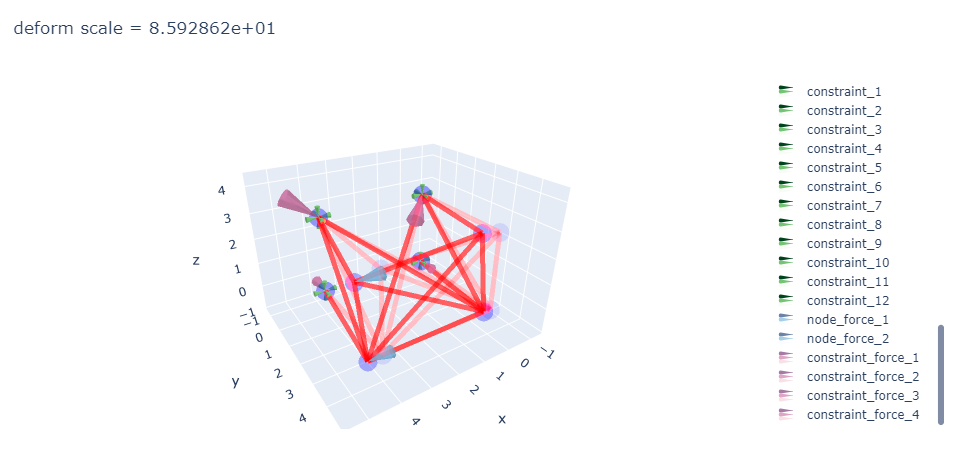

# 关于项目（myFEM）

 上海交通大学工程力学系有限元课程大作业

 FEM course project for SJTU students of engineering mechanics

## 基本功能

- 利用有限元方法，在给定的初始参数、边界条件下，计算空间桁架的节点位移、单元内力、应力等
- 能够生成输入数据报告，生成结果报告
- 能够进行可视化结果展示，结果具有较好的交互性
- 交互性说明：可进行缩放（滚轮）、旋转（左键）、平移（右键）、选择显示对象（单击图例）、显示对象属性（鼠标放置在对象上）等操作，可通过外部参数控制对象相对大小和透明度

## 环境配置

程序使用Python编写，需要环境（作者编写环境）：
- Anaconda
- Python3.8+
- plotly

## 文件说明
| 文件名	| 文件内容 |
|  ----  | ----  |
|myFEM.py	| 自编有限元模型库|
|exam.ipynb	| 考试例题文件|
|rodCase.ipynb	| 三维桁架算例文件|
|rodCase2d.ipynb	| 二维桁架算例文件|
|exam输入数据.txt	| 输入数据报告|
|rodCase输入数据.txt	| 输入数据报告
|rodCase2d输入数据.txt	| 输入数据报告|
|exam结果数据.txt	| 结果数据报告|
|rodCase结果数据.txt	| 结果数据报告|
|rodCase2d结果数据.txt	| 结果数据报告 |

## 算例

### 算例一（考试）
- 输入数据报告（见exam输入数据.txt）
- 结果数据报告（见exam结果数据.txt）
- 算例一输入示意图
    
- 算例一结果示意图
    

### 算例二（三维样例）
- 输入数据报告（见rodCase输入数据.txt）
- 结果数据报告（见rodCase结果数据.txt）
- 算例二输入示意图
    
- 算例二结果示意图
    

### 算例三（二维样例）
- 输入数据报告（见rodCase2d输入数据.txt）
- 结果数据报告（见rodCase2d结果数据.txt）
- 算例三输入示意图
    
- 算例三结果示意图
    

## 参考书目
1. 刘正兴 孙雁 王国庆 陶昉敏，《计算固体力学》，（第二版），上海，上海交通大学出版社，2010.